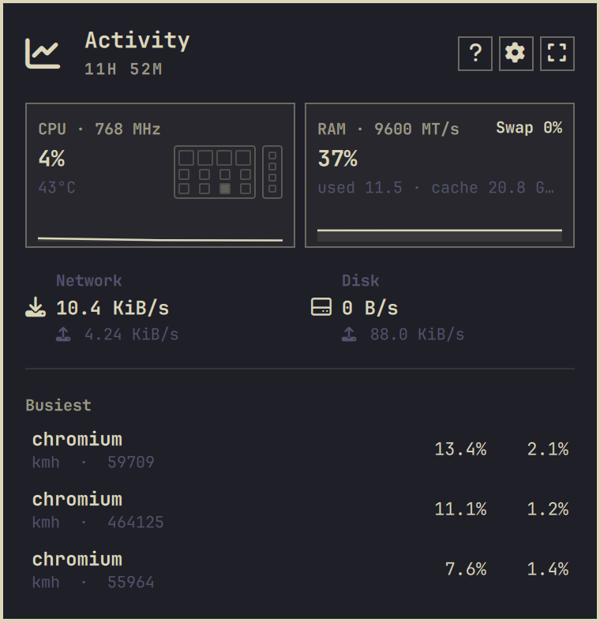
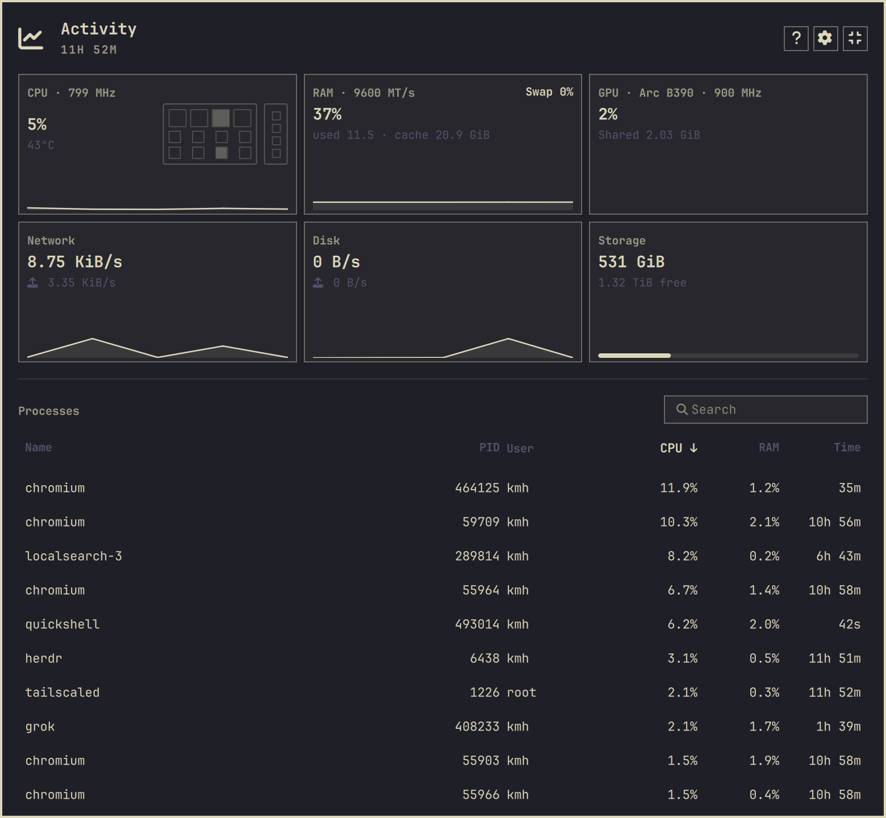
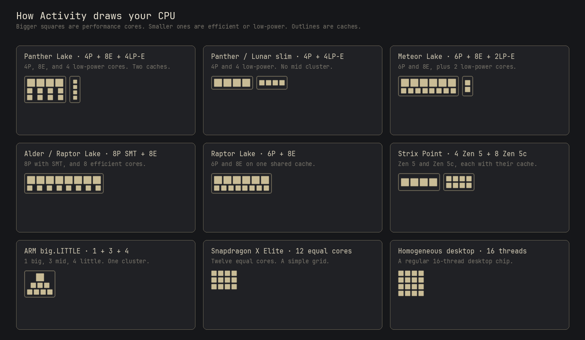

# Activity Monitor

A calm glance at what your machine is doing.

Open it from the bar when you want the picture — CPU, memory, network, disk, and the processes that actually matter. Close it, and it goes quiet. Nothing sits in the background burning power or attention.

It is built to be easy on your eyes and easy on the computer. One small native reader runs only while the panel is open. No extra daemons. No blinking wall of numbers.



Need more? Expand for GPU and storage, a live process table, and a little die that matches *your* CPU — performance cores, efficient cores, and low-power islands drawn the way the silicon is laid out.



Hybrid Intel, AMD Zen 5c, and ARM big.LITTLE each get their own shape. Older, even chips stay on a simple grid.



## Install

```bash
omarchy plugin add https://github.com/stappmus/omarchy-activity-monitor.git --enable
```

Or from Setup → Plugins. To turn it off later:

```bash
omarchy plugin disable stappmus.activity-monitor
omarchy plugin remove stappmus.activity-monitor
```

## Using it

- Click the bar icon to open. `e` expands, Esc collapses.
- `/` search processes. `j` / `k` move. Click a column header to sort.
- `s` opens settings — update speed, graph history, °C/°F, the bar graph, and
  whether to estimate process watts.
- `x` can close an app you selected, after a confirmation.

Settings are saved with your bar layout and apply immediately.

## The bar graph

Off by default. Set it to CPU or Memory in settings and the bar icon is replaced
by a live sparkline, themed like the rest of the panel. It behaves exactly like
the icon it stands in for: click to open, hover for a quick CPU and RAM reading.

Width is a setting too. The default is square — the same slot the icon occupied,
so it lines up with everything else on the bar — and 44, 72, or 110 px give the
trace more history to spread across.

This is the one setting that keeps a reader running while the panel is closed.
It stays deliberately cheap: only the resources snapshot is sampled, on a slower
3 s cadence, and processes, GPU, storage, and power estimates stay off until you
actually open the panel. Turn it back to Off and the plugin goes quiet again.

One advanced override can be set directly on the widget's entry in
`~/.config/omarchy/shell.json`, alongside the existing interval overrides:
`backgroundRefreshIntervalMs` (1000–30000, default 3000).

## A few honest details

Used memory follows Linux available-memory accounting, with cache shown separately because the kernel can reclaim it. GPU memory is what the driver actually reports — shared for integrated, VRAM for discrete. A power-gated GPU clock shows as `IDLE`.

Estimated watts (`~W`) are a share of measured CPU-package energy, not wall power. They only run in the expanded view, and you can turn them off.

If your kernel hides RAPL energy from users, an optional helper package can read it without a password prompt. The plugin never asks for sudo while you are watching the panel.

```bash
makepkg --cleanbuild --install
sudo pacman -Rns omarchy-activity-monitor-power-helper   # to remove it later
```

## Test

```bash
make -B activity-sampler
./test/all.sh
qmllint -I /usr/share/omarchy/shell ActivityController.qml Panel.qml ProcessActionController.qml Sparkline.qml
omarchy plugin validate .
```

Licensed under the MIT License. Started as an Omarchy activity panel and maintained as an independent plugin by Kristoffer Haugland.
